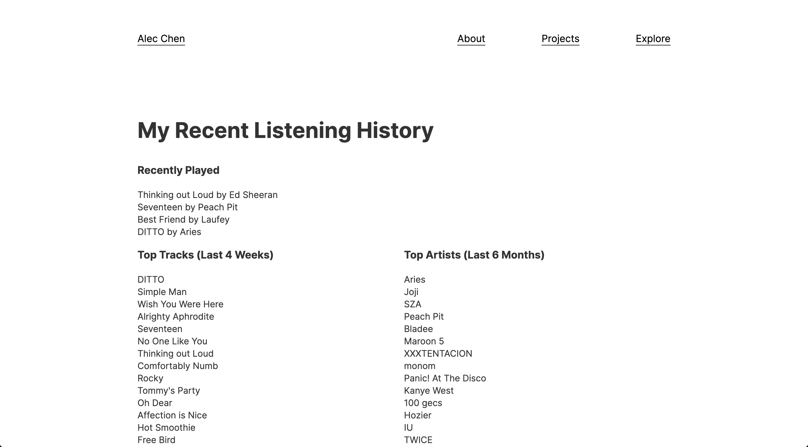

# spotify-refresh-token
A simple site for developers to easily get their own refresh token for Spotify's API.

#### :star: Please give this repo a star/share if it helps you at all!

### Motive
I was adding this page to my personal website that calls the Spotify API and just shows a brief listening history for my account.



However, to retrieve this information from the Spotify API, it requires you to log in. I didn't want all this overhead to just show my recent songs, so I ended up setting up the authorization in this [example repo](https://github.com/spotify/web-api-auth-examples) and going through all this trouble to get a refresh token, which allows you to get access tokens without logging in. I wished I could've easily used a site like this one I've built, where you can just put in your credentials and get your refresh token. So I built it.

### Setup
If you wanted to run this locally for some reason, just clone the repo, make sure you have [Node.js](https://nodejs.org/en/download/) installed and run these commands:

```
npm install
npm run build
npm run dev
```
